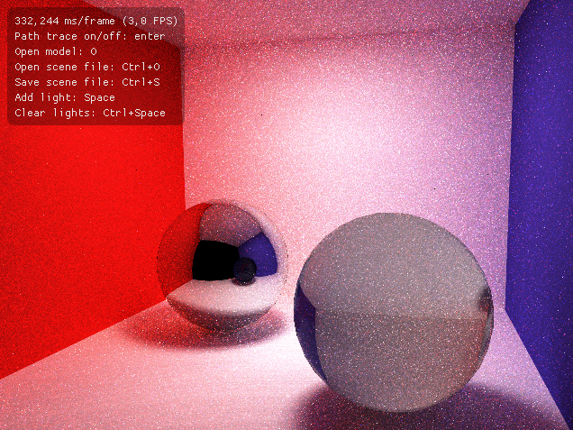

### Description

This is my new path tracing project. The old one had several shortcomings in the design so I decided to make a new one that would allow for further improvements.  
  
I got inspired by the wavefront architecture as described in this paper:  
    [1] Megakernels Considered Harmful: Wavefront Path Tracing on GPUs, Samuli Laine and Tero Karras and Timo Aila, NVIDIA  
  
The so called megakernel approach in my previous path tracer causes lots of incoherence between threads. This is alleviated now alleviated by arranging the paths into different queues depending on what material they hit. One kernel can then efficiently process all the paths in the queue, and as all the paths in the queue are processed similarily, higher work coherence is achieved.  

Also, in comparison to the previous one, the OpenGL preview model is now completely separate from the model used in the path tracer. This makes experimentation with the data layout easier.  
  
This is still work in progress, and therefore some obvious optimizations are still undone. They will be done in due time. 
### Requirements:

Have a look at the CMakeLists.txt but in short:

- CMake 3.10
- Ubuntu 16.04 or similar
- libx11-dev
- libgtk3-dev
- Cuda toolkit (Developed using 9.2)
- Recent Cuda capable GPU
- g++ 7

This program additionally uses:
- Dear IMGUI for user interface
- Nativefiledialog
- cxxopts
- glm
- glfw3

These dependencies are handled by CMake.

### Build
gcc 7 must be specified as the host compiler for release mode to work. This is done in CMakeLists.txt, assuming the compiler is accessible with "gcc-7"
```
cd $DOWNLOAD_DIR
mkdir build
cd build/
cmake ..
```

### Current features:
- SAH based bvh
- OpenGL preview
- Path tracer in CUDA


### Planned improvements:
- Proper MIS
- New materials
- SBVH according to the paper  
    [2] Spatial Splits in Bounding Volume Hierarchies, Martin Stich and Heiko Friedrich and Andreas Dietrich, Proc. High-Performance Graphics 2009
- Textures



Screenshot model downloaded from Morgan McGuire's Computer Graphics Archive https://casual-effects.com/data
